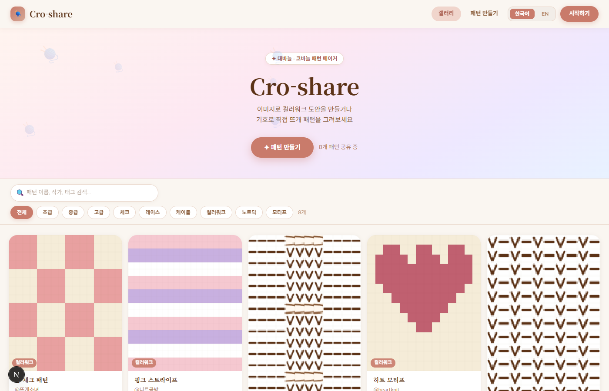
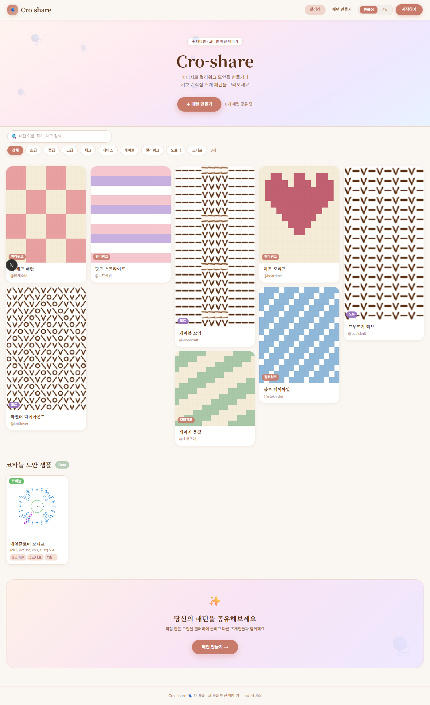
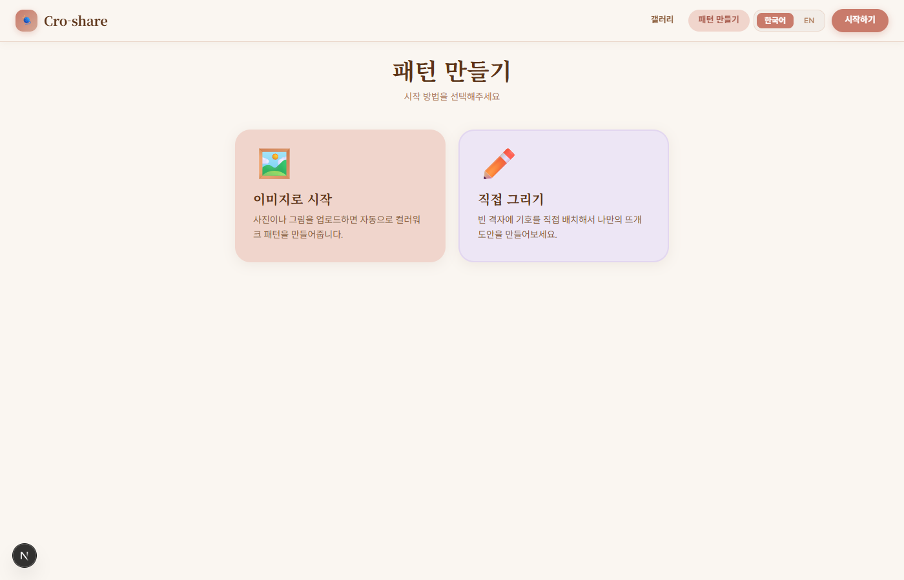

# Cro-share 🧶

> 이미지를 뜨개질 도안으로 — 대바늘·코바늘 패턴 메이커

[](https://nextjs.org)
[](https://www.typescriptlang.org)
[](https://tailwindcss.com)
[](https://zustand-demo.pmnd.rs)
[](LICENSE)

---

## 📸 스크린샷

### 갤러리 홈 — Pinterest 스타일 매소너리



> 태그 필터 · 실시간 검색 · 좋아요 · hover 하트 저장 버튼

---

### 갤러리 전체 스크롤



---

### 패턴 만들기 — 모드 선택


> 이미지로 시작 / 직접 그리기 두 가지 입력 모드

---

### 이미지 업로드 → 자동 컬러워크 생성



> 비율 보존 자동 격자 크기 · 실 색상 수 조절 · 즉시 도안 생성

---

### 도트 그리기 에디터


> 기호 팔레트 · 대칭 모드 · 채우기 모드 · undo/redo

---

## ✨ 주요 기능

### 🖼 이미지 → 컬러워크 도안

- 사진 업로드 → **Median Cut** 색상 양자화로 실 색상 팔레트 자동 추출
- **이미지 비율 자동 보존** — `naturalWidth / naturalHeight` 기반 격자 크기 계산 (찌부러짐 방지)
- 실 색상 컬러휠로 편집 → 도안 전체 즉시 반영
- Canvas 기반 샘플 이미지 제공 (꽃·고양이·산, 5~6가지 뚜렷한 색상)

### ✏️ 직접 그리기 모드

- **18가지 CYC 표준 기호** — 겉뜨기·안뜨기·걸기코·줄임코·늘림코·케이블 등
- **대칭 그리기 4모드** — 없음 / ↔ 좌우 / ↕ 상하 / ✦ 전체 (미러 셀 동시 칠하기)
- **채우기 모드 (Flood Fill)** — BFS로 인접 동일 영역 한꺼번에 채우기
- Space+드래그 이동 / 휠 확대·축소 / 우클릭 지우기
- **Undo/Redo** 20단계 (Ctrl+Z / Ctrl+Y)

### 🍀 코바늘 도안 샘플 (Beta)

- 네잎클로버 모티프 Canvas 렌더링 — `(mr, ch3, dc5 bo, ch3, sl st) × 4`
- 기호 도안 + 텍스트 도안 동시 표시 · 색상 범례

### 🏛 커뮤니티 갤러리

- Pinterest 스타일 **CSS 매소너리** 그리드 (2~5열 반응형)
- 태그 필터 + 검색 · 좋아요 · Hover 하트 버튼
- 내 패턴 공유 → 갤러리 자동 등록 (localStorage)
- 갤러리에서 "편집하기" → 에디터로 차트 불러오기

### 🌐 한국어 / English 토글

- 헤더에서 전역 언어 전환
- 텍스트 패턴 · 기호 팔레트 · UI 레이블 동시 전환

---

## 🛠 기술 스택

| 분류 | 기술 |
|------|------|
| 프레임워크 | Next.js 16.2 (App Router, Turbopack) |
| 언어 | TypeScript 5 |
| 스타일 | Tailwind CSS v4 (`@theme` 커스텀 토큰) |
| 상태 관리 | Zustand |
| 도안 렌더링 | Canvas API (외부 차트 라이브러리 없음) |
| 색상 양자화 | Median Cut + CIE76 Lab 색차 |
| 이미지 업로드 | react-dropzone |
| 폰트 | Caveat · Nunito · Noto Serif KR |

---

## 🚀 시작하기

```bash
# 1. 클론
git clone https://github.com/yeyounglim-01/cro-share.git
cd cro-share

# 2. 의존성 설치
npm install

# 3. 개발 서버
npm run dev
# → http://localhost:3000
```

---

## 🗂 프로젝트 구조

```
src/
├── app/
│   ├── page.tsx                  # 갤러리 홈
│   └── editor/page.tsx           # 패턴 에디터
│
├── components/
│   ├── chart/KnitSymbolChart.tsx # 도안 Canvas (줌·팬·편집)
│   ├── crochet/CrochetSection.tsx# 코바늘 도안 섹션
│   ├── draw/StitchPalette.tsx    # 기호 팔레트
│   ├── gallery/PatternCard.tsx   # 매소너리 카드
│   ├── layout/Header.tsx         # 헤더 + 언어 토글
│   └── pattern/PatternText.tsx   # 텍스트 패턴 출력
│
├── hooks/
│   ├── useKnitChartState.ts      # Zustand 스토어
│   └── useDrawTool.ts            # 그리기·채우기·대칭·history
│
└── lib/
    ├── crochet/drawCrochetClover.ts
    ├── imageProcessing/          # Median Cut · 이미지→도안
    ├── knitting/                 # 기호 DB · 패턴 생성 · Canvas 드로잉
    └── utils/                    # 색상 · 내보내기
```

---

## 📊 프로젝트 진행상황

### ✅ 완료 (2026-04-10)

**갤러리 UI 현대화 (feature/gallery-redesign)**
- ✨ DaisyUI v5 도입 · Tailwind CSS v4 적용
- 🎬 Apple 스타일 풀스크린 Hero (영상 배경 + 스크롤 시 페이드아웃)
- 🖼️ Pinterest 스타일 매소너리 그리드 갤러리
- 🎯 카테고리 분리 (난이도: 전체/초급/중급/고급, 패턴: 체크/레이스/케이블/컬러워크/노르딕/모티프)
- 🔍 실시간 검색 · 필터 · 좋아요
- 🌐 언어 토글 (한국어 ↔ English) + 슬라이드 스위치 애니메이션

**버그 수정 + 디테일 개선**
- 🐛 Chrome btn-primary 파란색 버그 (primary 색상 우선순위 해결)
- 🔤 폰트 전체 통일 (serif → sans-serif: Noto Sans KR)
  - 갤러리 카테고리 · 모달 · 에디터 제목 · 카드 텍스트
- 🎨 ExportPanel 배경색 (sage-light → blush)
- 📜 PatternModal 스크롤 개선 (overflow 충돌 해결)
- 🏁 하단 CTA → 심플 footer (로고 + 시작하기 버튼)

### 🔄 진행 중 / 계획

**1단계: 핵심 기능 추가**
- [ ] **게이지 보정** — 코수·단수 비율로 실제 비율에 맞게 도안 보정
- [ ] **그리드 크기 자동 계산** — 이미지 업로드 시 자동으로 최적 크기 제안
- [ ] **색상수 조절 시 자동 재생성** — 컬러 파레트 자동 추출

**2단계: 편집 기능 강화**
- [ ] **드래그 편집** — 마우스 드래그로 빠르게 색상 채우기
- [ ] **진행모드** — 뜨면서 현재 단 위치 추적 (해당 줄 색상 강조)

**3단계: 내보내기 개선**
- [ ] **PDF 내보내기** — 인쇄용 PDF 생성
- [ ] **색상범례** — PNG 저장 시 색상 목록 자동 포함

**4단계: 추가 기능**
- [ ] 빈 도안으로 시작하기 기능
- [ ] 패턴 메타데이터 (작가, 난이도, 설명 등) 편집
- [ ] 갤러리 내 도안 상세 페이지

### 🧪 테스트 대상

| 항목 | 상태 | 메모 |
|------|------|------|
| 갤러리 로드 | ✅ | DaisyUI 적용 완료 |
| 언어 전환 (EN/KO) | ✅ | 슬라이드 토글 + 메인 화면 실시간 변경 |
| 에디터 모드 | ✅ | 이미지 · 그리기 모드 모두 작동 |
| Chrome btn색상 | ✅ | rose 색상으로 통일 |
| 폰트 통일 | ✅ | 모든 제목 sans-serif |
| 모달 스크롤 | ✅ | 부드러운 스크롤 동작 |

---

## 🎨 디자인

따뜻한 수채화 파스텔 팔레트 · Caveat(스케치) · Nunito(본문) · Noto Serif KR

| 토큰 | 색상 | 용도 |
|------|------|------|
| `--color-rose` | `#C97B6B` | 주요 강조 · 버튼 |
| `--color-cream` | `#FAF6F1` | 전체 배경 |
| `--color-ink` | `#5C3317` | 텍스트 |
| `--color-lavender` | `#D4C5E2` | 보조 강조 |

---

## 📝 License

MIT © 2026 [yeyounglim-01](https://github.com/yeyounglim-01)
